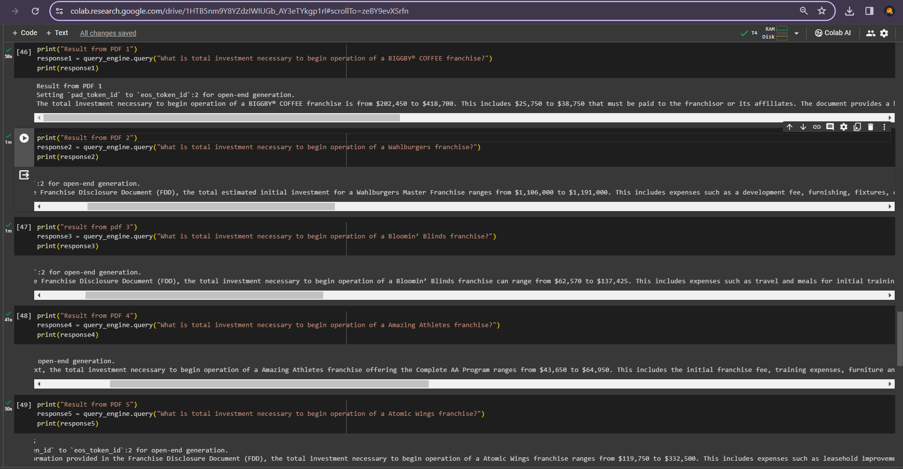

# Chatbot-RAG-with-llama

## Overview
Goal :
The primary goal of this project is to create a chatbot capable of answering user queries based on content extracted from a set of provided PDF documents. The chatbot is trained using a Language Model (LLM), and the information is stored and retrieved from a vector database. The project aims to showcase the ability to leverage both pre-trained language models and vector databases to build an intelligent and informative chatbot.

## Project Highlights
- **Document Scale**: Processed 5 PDFs, each with around 300 pages, showcasing the project's capability to handle substantial volumes of information.
- **Model**: Leveraged Mistral-7B-Instruct from Hugging Face for advanced language understanding.
- **Processing**: Integrated vector databases with llama-index for efficient storage and retrieval of information.
- **Interactive Experience**: Designed a dynamic interface using Gradio for an engaging user experience.
- **Intelligence**: Implemented fallback mechanisms utilizing Language Models to enhance responses.
- **Deployment**: Successfully deployed on Gradio for a seamless and user-friendly interaction.

## Technical Stack
- PyTorch, langchain, accelerate, transformers, bitsandbytes, scipy
- Hugging Face Transformers Library
- llama-index for vector database management
- Gradio for UI deployment

## Project Flow
1. **Model Setup**: Used Mistral-7B-Instruct with torch.float16 and 8-bit loading.
2. **User Query Handling**: Employed a systematic approach to handle user queries effectively.
3. **Language Model Integration**: Integrated Hugging Face LLM via llama-index for enhanced language understanding.
4. **Embeddings and Vector Databases**: Represented document chunks using Hugging Face embeddings and stored in a vector database powered by llama-index.
5. **Service Context Configuration**: Set up a robust service context using llama-index.
6. **Document Loading and Indexing**: Successfully loaded and indexed data from 5 PDFs, each around 300 pages, using llama-index.
7. **Testing and Results**: Validated the solution's performance with real queries, achieving accurate responses from each extensive PDF.

